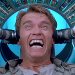

[Index](../TOTAL.md) | [Previous: Vision](Vision.md) | [Next: Technical](Technical.md) 

#User Stories#

The Recall project approached the development of work related packages using BDD related principles.
This included developing Personas for imagined individuals who would interact with the system. In turn
this enabled us as developer to project scenarios forward and develop stories to guide development of
the system. Further we aligned our discussions to a DDD view, including Event Sourcing so elements from
these discussions will hopefully be visible in the final codebase.

##Personas##

###Primary###
*Scenario: Self*

>  
*Name:* **Douglas** (Quaid)  
*Age:* 26  
*Gender:* Male  
*Professional Group:* Tester in a technical team (at Rekall)  
*Problem:* Work related stress. Fred has had some periods off (sick) from work due to stress. Fred feels
like he can't admit the stress problems at work.  
He has been to the G.P. before and now has a second appointment and hopes to now get some medication to
help with the symptoms.

###Additional###
*Scenario: Push*

>*Name:* **Bob**  
*Age:* 42  
*Gender:* Male  
*Professional Group:* Community based doctor / G.P. / huisarts  
*Scenario:* Local doctor in a practice with 4 other doctors and admin staff  
*Achievement:* Bob has to prescribe a treatment for Fred, a prescription  
*Action:* Bob is now seeing Fred for the second time and now prescribes him some sleep medication,
he also refers Fred to Wilma, the specialist.

*Scenario: Pull*

>*Name:* **Alice**  
*Age:* 32  
*Gender:* Female  
*Professional Group:* Pharmacist  
*Scenario:* Fred presents himself, at the Pharmacy, and Alice pulls down the prescription/recipe that Bob
pushed to Fred's Recall server. However, before she dispenses the medication, she verifies Bob's e-Signature on
the prescription/recipe. Bob is notified about the prescription/recipe collection.

*Scenario: Push/Pull*  
This scenario has had less attention as was considered mostly out of scope for the project timescale

>*Name:* **Wilma**  
*Age:* 50  
*Gender:* Female  
*Professional Group:* Mental Health Specialist

##EPIC Stories##

High level stories developed from personas, including MoSCoW status for the Wecamp timescale

1. Authentication (W)
2. Authorisation (C)
3. Verification of Authenticity (C)
4. Core Data Set ( **M** )
5. Medical Data Set ( **M** )
6. Push (write) ( **M** )
7. Pull (read) (S)
8. Notifcation (W)
9. View My Timeline ( **M** )
10. View the Timeline of My Patient (S)
11. Push Request ( **S** - this became the first 'stretch goal' if time allowed,
to complete the full round trip for the scenario)
12. View My Details (Timeline entries) ( **M** )